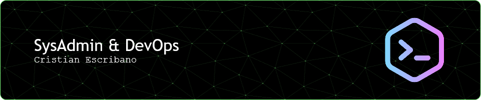

## 🖖 Choose a job you love, and you will never have to work a day in your life.

📚 I’m currently learning about Cloud, DevOps and automations 🔭

💚 In love with...

🌍 Terraform / HCTA0-003 Certified 🏅

🐳 Docker

🚢 Kubernetes

🕵️‍♂️ Jenkins

<!--
**ced-labs/ced-labs** is a ✨ _special_ ✨ repository because its `README.md` (this file) appears on your GitHub profile.

Here are some ideas to get you started:

Link para los botones/shield
https://github.com/Ileriayo/markdown-badges?tab=readme-ov-file#markdown-badges

**Negrita**
*Itálica*

`Para pequeños bloques de código de un párrafo´

# Es H1
###### Es H6

Para añadir una cita
> Esta es la cita1
> Esta es la cita2

Lista
Numerada
1. X
2. Y

Sin numerar
- X
- Y

Mixed
1. X
  - X1
  - X2
2. Y

Insertar imagen

Imagen con link

Para agregar una línea separadora añade tres guiones medios ---

-->
